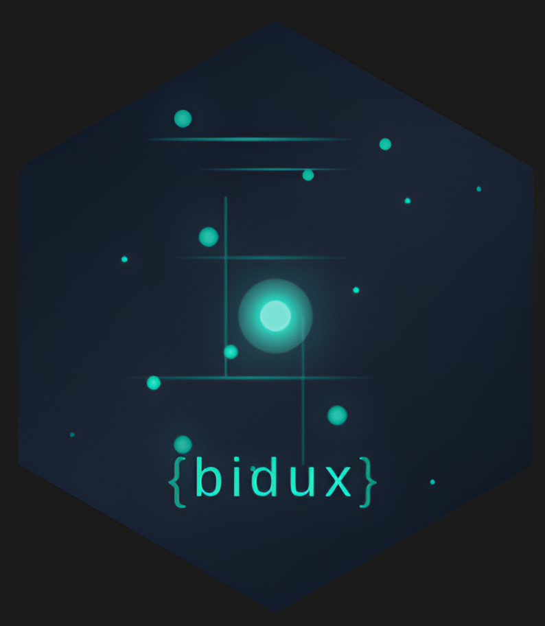

<!-- README.md is generated from README.Rmd. Please edit that file -->

# bidux <a href="https://github.com/jrwinget/bid-framework"></a>

<!-- badges: start -->

[](https://cran.r-project.org/package=bidux)
[](https://github.com/jrwinget/bidux/actions/workflows/R-CMD-check.yaml)
[](https://app.codecov.io/gh/jrwinget/bidux)
[](https://cranlogs.r-pkg.org/badges/bidux)
[](https://github.com/jrwinget/bidux)
<!-- badges: end -->

## 📖 Overview

`{bidux}` brings the Behavior Insight Design (BID) framework into your
Shiny development workflow. Follow five staged functions (Notice,
Interpret, Structure, Anticipate, Validate) to systematically apply
psychological principles to UI/UX design and build more intuitive
dashboards.

## 🚀 Key Features

- **Notice** friction points (`bid_notice()`)
- **Interpret** user needs (`bid_interpret()`)
- **Structure** dashboard layouts (`bid_structure()`)
- **Anticipate** behavior & biases (`bid_anticipate()`)
- **Validate** & empower users (`bid_validate()`)
- **Telemetry Integration**: ingest real usage data to auto-detect UX
  issues (`bid_ingest_telemetry()`)
- **Component Suggestions**: get tailored UI component ideas for
  `bslib`, `shiny`, `reactable`, `echarts4r`, and more
- **Reporting**: generate HTML, Markdown, or text reports of your BID
  process

## 📥 Installation

Install from CRAN:

``` r
install.packages("bidux")
```

Or the development version:

``` r
# install.packages("pak")
pak::pak("jrwinget/bidux")
```

## ✅ Quick Start

``` r
library(shiny)
library(bidux)

# Document a simple BID pipeline
process <-
  bid_notice(
    problem = "Users struggle to find key metrics",
    evidence = "70% of users spent >30s searching"
  ) |>
  bid_interpret(
    central_question = "Which metrics drive decisions?",
    data_story = list(
      hook = "Key metrics hidden",
      resolution = "Surface top metrics up front"
    )
  ) |>
  bid_structure(
    layout = "dual_process"
  ) |>
  bid_anticipate(
    bias_mitigations = list(anchoring = "Contextual defaults")
  ) |>
  bid_validate(
    summary_panel = "Insights summary"
  )

# View suggestions
bid_suggest_components(process, package = "bslib")

# Generate an HTML report
bid_report(process, format = "html")
```

## 📊 Telemetry Integration

Leverage real user behavior to pinpoint UX friction with
[`{shiny.telemetry}`](https://github.com/Appsilon/shiny.telemetry) data:

``` r
# Ingest telemetry from SQLite or JSON
issues <- bid_ingest_telemetry(
  "telemetry.sqlite",
  format = "sqlite"
)

# Inspect detected issues
str(issues)
```

`bid_ingest_telemetry()` automatically flags five friction indicators:

1.  **Unused Inputs**: controls rarely interacted with
2.  **Delayed Interactions**: long time-to-first-action
3.  **Frequent Errors**: recurring error patterns
4.  **Navigation Drop-offs**: seldom-visited tabs/pages
5.  **Confusion Patterns**: rapid repeated changes

Use these insights to fuel the **Notice** stage and drive data-informed
UI improvements. See the full example and thresholds customization in
the See the package vignette ‘Telemetry Integration’ for a full example
(accessible via `vignette("telemetry-integration", package="bidux")`).

## 📚 Vignettes

Explore detailed guides:

- `vignette("introduction-to-bid")`: BID framework overview
- `vignette("getting-started")`: Quick start guide
- `vignette("concepts-reference")`: Comprehensive concept dictionary
- `vignette("telemetry-integration")`: Integrating telemetry with BIDUX

## 🤝 Contributing

We welcome all contributions! Please see [Contributing
Guide](https://github.com/jrwinget/bidux/blob/main/.github/CONTRIBUTING.md)
for guidelines, issue templates, and code style.

## 📜 License & Code of Conduct

This project is MIT licensed. By contributing, you agree to our [Code of
Conduct](https://github.com/jrwinget/bidux/blob/main/.github/CODE_OF_CONDUCT.md).
